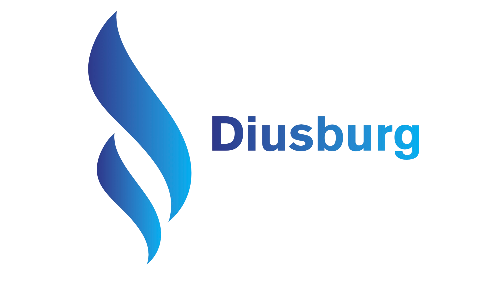

<p align="center">  </p>

<h1 align="center"><code>Diusburg's Landing Page</code></h1>
<p align="center">
    <strong>Diusburg is a network of young people, experienced mentors, designers, <br> developers and working proffesionals.
    </strong>
</p>

<p align="center">
    <a href="https://github.com/devstrons/hello-world/graphs/contributors">
        
    </a>
    <a href="https://github.com/devstrons/hello-world/issues">
        
    </a>
    <a href="https://github.com/devstrons/hello-world/commits/main">
        
    </a>
</p>
<br>

## 🤔 Who we are?
We are learning, networking and an IT solutions platform having a solid network of IT experts and working Tech proffesionals. We are providing teaching, networking and IT solutions facilities by a community of experts across the globe.

## 📚 Why Diusburg?
We are the first in India to help those students who wants to go abroad for their higher education. We are **mentoring 500+ students** and helping them to master the skills in **tech industry**.

## 🧐 Why we are different form other community?
**There are some points which make different us from other are :**

- We are a network of people, passion to work

- We belive in win-win situation

- We take pride in helping out others

- Contributing to the society

- Walking in new dimensions of development, designing, marketing and business

## ✨ Our Services
- [IT Services](https://diusburg.github.io/LandingPage/#services)

- [ED Tech](https://diusburg.github.io/LandingPage/#services)

- [Networking](https://diusburg.github.io/LandingPage/#services)

## 🔥 We Belive in data
- 20+ Mentors

- 500+ Community Member

- 1000+ Students

- 360 Work Hours

## 📃 Guidelines To Contribute 
1. Make sure to fork the repository, so it's available to your GitHub account, for further contributions as well as it state your contributions in it.


2. Clone the repository from your account to local PC, so its available to you locally. Also, you can make changes in it.

    ```
        git clone https://github.com/<your-username>/<repo-name>
    ```

3. Now, set the `upstream` so it make a "path of contribution" from your account's repo. (repository) to original repository.


    ```
       git remote add upstream https://github.com/<org-name>/<repo-name>.git
    ```

4. After done with the changes in code, get ready to contribute, Excited ? :star_struck: 

5. Make your own branch by using following command:
    ```
        git checkout -b <branch-name>
    ```

6. Now, you've to add the changes in that branch, you created just above.
    ```
        git add .
    ```
7. Lets commit the changes, & earn "green square of the day".
    ```
        git commit -m "<message>"
    ```
8. Now, just push the changes from your repo. to original repository.
    ```
        git push origin <branch-name>
    ```
9. Once you've committed and pushed all of your changes to GitHub, go to the page for your fork on GitHub, select your development branch, and click the pull request button. If you need to make any adjustments to your pull request, just push the updates to GitHub. Your pull request will automatically track the changes in your development branch and update it.
 
 ## 📰 License

> The **Disburg  Landing Page** is released under the [MIT license](https://github.com/devstrons/contest-bot/blob/main/LICENSE.md). <br> Developed &amp; maintained By the DISBURG'S Community. Copyright 2021 © DISBURG All Right Reserved.
<hr>

> **Website**<a href="https://diusburg.github.io/LandingPage/" target="_blank" rel="noopener">@Disburg</a> &nbsp;&middot;&nbsp;
> **Instagram** <a href="https://www.instagram.com/diusburg.2021/" target="_blank" rel="noopener">@diusburg.2021</a> &nbsp;&middot;&nbsp;
> **Discord** <a href="https://discord.gg/hxgtXHRd" target="_blank" rel="noopener">Diusburg'</a> &nbsp;&middot;&nbsp;
> **Twitter** <a href="https://twitter.com/Diusburg2021" target="_blank" rel="noopener">@Diusburg2021</a>
> **Facebook** <a href="#" target="_blank" rel="noopener">@Diusburg2021</a>
> **Linkedin** <a href="https://www.linkedin.com/company/diusburg-pvt-ltd/" target="_blank" rel="noopener">@Diusburg Pvt. Ltd.</a>
